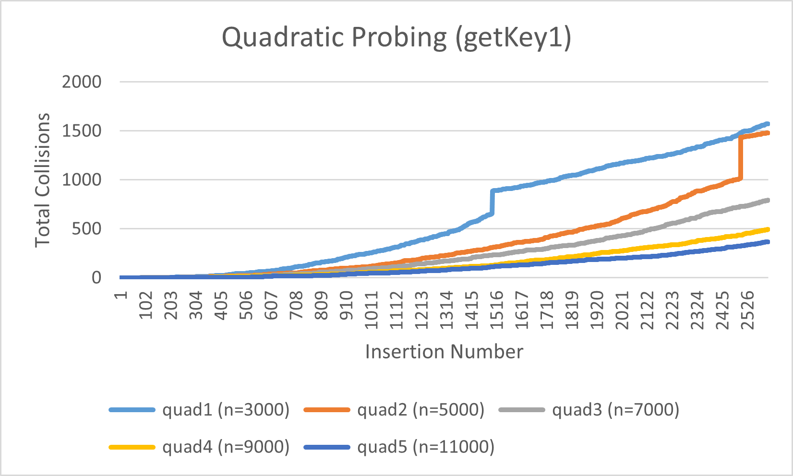

# Project 5 Report

Answer the following prompts directly in this file:
* Information about your dataset. You will be assigned a different grader for this project.

The data is from registered professional soccer players in the top 5 soccer leagues in the world. There are 2612 entries with
16 characteristics for each entry including name, age, team, position, price, etc. The name field may use
special characters, so there may be unusual characters in the names since they are not correctly printed.

* Create graphs for the number of collisions for inserting your dataset into all 20 hash tables.

The total collision counts are smaller for tables of greater size because collisions are less likely to occur when there
is more room for values to be inserted into the table. For example, the Separate Chaining table of size 3000 using the first
key function had a total of 1142 collisions, whereas the same table except of size 11000 had a total of 299 collisions. This is
due to the hashing process, where first a hash value is created from the unique key, produced by the global key function, 
identifying the Players item being inserted. Then, the has value is modded by the table size, which produces an index for the
item to be inserted at; and it is this step which greatly contributes the total collision count for a table. For instance, in a
table of size 3000, hash values that can procure an index of 1000 include 1000, 4000, 7000, and so on. Meanwhile, to procure an index
of 1000 in a table of size 11000, the hash values could be 1000, 12000, 23000, and so on. Evidently, the hash values required to create
the same index differ greater in a table of size 11000 compared to a size of 3000. So, with the smaller sized tables, items are more likely
to be placed at an index where previous items were inserted, causing the new item to collide with the other existing items, and the total
collision count increases as a result.
This is evident in the graphs, as the line labeled sep1 (n=3000) increases at a significantly faster rate than sep5 (n=11000).
As the number of items in sep1 (n=3000) increases, new items more often collide with items already inserted at the same index. Plus, the
new item will likely collide with numerous items at that index due to the smaller-sized table accommodating a dataset of 2612 items, nearly
the size of the table.

* Determine which global function works best as the key for your dataset objects based on the collision counts.

The first key function (getPlayerIndexName) performed fewer collisions than
the second key function (getPlayerIndexNationality) for all Separate Chaining tables
and the larger two Quadratic Probing tables. On average, the first key function performed 33.8
fewer collisions than the second key function for Separate Chaining tables, while it performed 18
more collisions for Quadratic Probing tables. Overall, the first key function is better because it
performs, on average, fewer collisions than the second key function.

* Draw conclusions about which hash collision detection method works best on your dataset (separate chaining or open addressing).

Comparing each Separate Chaining and Quadratic Probing table of the same key function and
initial table size, the all Separate Chaining tables had fewer collisions than their Quadratic
Probing counterparts. On average, Separate Chaining tables had 617.7 collisions, while Quadratic 
Probing tables had 933.2 collisions. Considering this information, Separate Chaining appears to be
a better hash collision detection method for the Players data.

**Note: Any code that was not authored by yourself or the instructor must be cited in your report. This includes the use of concepts not taught in lecture.**